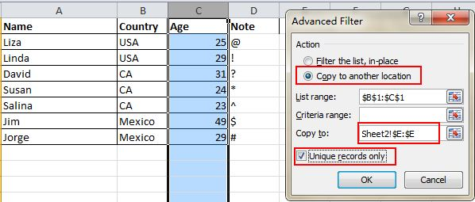

# Top 10 Excel Tips and Tricks 2019

<h2>Trick # 1 : Generate a Unique Value in a Column </h2>

Click to choose the column and go to Data->Advanced. A pop-up window will show up. As the screenshot shows, click Copy to another location, which should be in accord with the second red rectangular area. Then specify the target location by typing the value or clicking the area-choosing button. 

<h2>Trick # 2 : One Click to Get More Status</h2>

Most users know how to check the data status in the bottom of an Excel sheet, like Average and Sum Value. However, do you know you can move the pointer to the bottom tab and right click to get more status

<h2>Trick # 3 : Add More Than One New Row or Column</h2>

You may know the way to add one new row or column, but it really wastes a lot of time if you need to insert more than one of these by repeating this action X number of times. The best way is to drag and select X rows or columns (X is two or more) if you want to add X rows or columns above or left. Right click the highlighted rows or columns and choose Insert from the drop down menu. New rows will be inserted above the row or to the left of the column you first selected.

<h2>Trick # 4 : Input Values Starting with 0</h2>

When an input value starts with zero, Excel will delete the zero by default. Rather than reset the Format Cells, this problem can be easily solved by adding a single quote mark ahead of the first zero

<h2>Trick # 5 : Hide Data Thoroughly</h2>

The best and easiest way to hide data thoroughly is to use the Format Cells function. Choose the area and go to Home->Font->Open Format Cells->Number Tab->Custom->Type ;;; -> Click OK, then all the values in the area will be invisible, and can only be found in the preview area next to the Function button.

<h2>Trick # 6 : Input Restriction with Data Validation Function</h2>

In order to retain the validity of data, sometimes you need to restrict the input value and offer some tips for further steps. For example, age in this sheet should be whole numbers and all people participating in this survey should be between 18 and 60 years old. To ensure that data outside of this age range isn’t entered, go to Data->Data Validation->Setting, input the conditions and shift to Input Message to give prompts like, “Please input your age with whole number, which should range from 18 to 60.” Users will get this prompt when hanging the pointer in this area and get a warning message if the inputted information is unqualified.

<h2>Trick # 7 : Vague Search with Wild Card</h2>

You may know how to activate the speedy search by using the shortcut Ctrl + F, but there are two main wild cards—Question Mark and Asterisk—used in Excel spreadsheets to activate a vague search. This is used when you are not sure about the target result. Question Mark stands for one character and Asterisk represents one or more characters. What if you need to search Question Mark and Asterisk as a target result? Don’t forget add a Wave Line in front.

<h2>Trick # 8 : Rename a Sheet Using Double Click</h2>

There are multiple ways to rename sheets, and most users will right click to choose Rename, which actually wastes a lot of time. The best way is to just click twice, then you can rename it directly.

<h2>Trick # 9 : Compose Text with &</h2>

Complicated formulation is unnecessary, as long as you know how to use &. You can compose any text freely with this symbol. Below I have four columns with different texts, but what if I want to compose them to one value in one cell? First, locate the cell that is to show the composed result, use the formulation with & as shown in the screenshot below. Click Enter: all texts in A2, B2, C2 and D2 will be composed together to become LizaUSA25@ in F2.

<h2>Trick # 10 : Speedily Delete Blank Cells</h2>

Some default data will be blank, for various reasons. If you need to delete these to maintain accuracy, especially when calculating the average value, the speedy way is to filter out all blank cells and delete them with one click. Choose the column you want to filter, go to Data->Filter, after the downward button shows, undo Select All and then pick up the last option, Blanks. All blank cells will show immediately. Go back to Home and click Delete directly, all of them will be removed.
